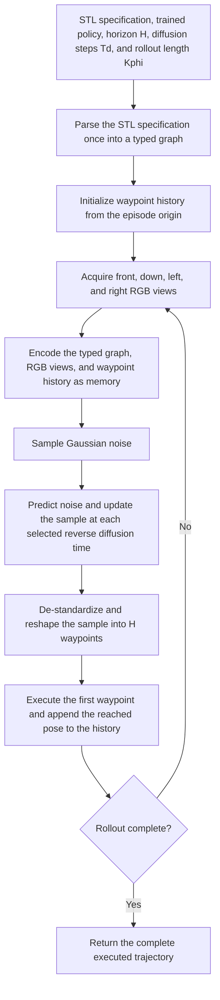

# STDP: Signal Temporal Logic-Guided Diffusion Policy for UAV Visual Navigation without Global Semantic Maps

> This repository is anonymized for double-blind review.

## Open-Source Progress

| Component | Status |
|---|---|
| Dataset | [Released on Hugging Face](https://huggingface.co/datasets/bfz111/STDP-Dataset) |
| Model weights | Released |
| Source code | Coming soon |

## Method

We introduce the Signal Temporal Logic-Guided Diffusion Policy (STDP), which
generates receding-horizon three-dimensional (3-D) waypoints from STL
specifications, local multi-view RGB observations, and motion history. A
relation-aware graph Transformer preserves operator semantics, temporal
intervals, predicate attributes, and directed operand relations, while
cross-attention-based conditional diffusion grounds these structured tokens in
visual and motion cues.

  

### Closed-Loop Planning Algorithm

## Experimental Results

Table II reports task-wise results in the ID scene and three OOD scenes, in
which values are episode-level micro-averages within each scene. In Scene-1,
STDP reached an overall SRSTL of 63.6% with a CR of 2.7%; Reach-Avoid
was strongest (81.8%), whereas Either-Or, Multi-Target, and Door Puzzle achieved
63.8%, 63.0%, and 41.5%. The decrease with task composition indicates that
multiple events, alternatives, and longer sequences remain more demanding than
bounded reach-and-avoid behavior.

Across OOD scenes, pooled SRSTL was 41.7% (CR, 4.1%), with
scene-level SR between 33.2% and 47.7%. Reach-Avoid remained highest (60.5%),
while the other tasks reached 32.6–34.9%. The drop under changed geometry and
furniture placement was largest for multi-event and branching specifications,
yet satisfaction remained substantial without access to a global semantic map
or OOD adaptation.

Figure 3 illustrates a successful planning example for each representative STL
task. Solid blue and dashed gray curves denote executed and reference
trajectories, respectively; green and orange overlays denote target and
avoidance regions.

  

  

### Ablation Studies

#### 1. STL Encoder

With the planner fixed, the graph Transformer increased overall
SRSTL from 38.2% to 63.6% in ID and from 30.8% to 41.7% in OOD,
improving every task family while keeping overall CR at or below 4.1% (Table
III). The gain supports more effective encoding of nested operators, temporal
intervals, and predicate dependencies than CLIP-Text.

  

#### 2. Trajectory Model

Diffusion was most useful for compositional specifications: cross-attention-
based conditional diffusion remained close to the Transformer baseline on
Reach-Avoid (81.8% versus 72.7% in ID; 60.5% versus 65.6% in OOD), but improved
the other tasks by 18.9–55.3 points in ID and 9.5–25.9 points in OOD (Table IV).
CR changed by -0.9 and 1.8 points, supporting stronger complex-task planning
and cross-scene transfer without a commensurate collision increase.

Cross-attention-based conditional diffusion outperformed FiLM-based
conditional diffusion across scenes and task families, with overall gains of
25.9 points in ID and 10.0 points in OOD; gains were largest on complex tasks
(24.5–40.4 points in ID and 7.5–15.5 points in OOD), while CR stayed at or
below 4.1%. Token-level cross-attention therefore extracts and aligns STL,
multi-view, and motion-history conditions more effectively than global
FiLM-based conditional modulation.

  

#### 3. DDIM Denoising Steps

Table V shows the performance of different DDIM denoising steps, where 20 steps
outperformed both 10 and 50 steps. Too few steps provided insufficient
refinement for reliable planning, whereas an excessively long reverse process
may accumulate approximation errors; we therefore used 20 steps throughout.

  

## Released Dataset and Model Weights

### Dataset

The complete dataset is hosted on
[Hugging Face](https://huggingface.co/datasets/bfz111/STDP-Dataset). It contains
synchronized Gazebo observations and reference trajectories from four
furnished indoor scenes. Each trajectory includes:

- a semantic STL specification and its coordinate-grounded form;
- synchronized `front`, `down`, `left`, and `right` RGB observations; and
- a CSV trajectory containing absolute XYZ positions, camera yaw, frame
  indices, and image filenames.

The `splits/` directory provides the following manifests:

- `train.jsonl`: training data from the primary scene;
- `validation.jsonl`: validation data from the primary scene;
- `test_same.jsonl`: evaluation data from the primary scene; and
- `test_cross.jsonl`: cross-layout evaluation data from the remaining scenes.

Each JSONL record contains the STL formula, task type, scene identifier,
trajectory path, and four image-directory paths. The dataset is distributed as
one archive per trajectory. Extracting an archive restores its `data/` paths
relative to the dataset root. To use the dataset, select a split, read its
JSONL records, download and extract the corresponding trajectory archives,
then load the referenced CSV and synchronized image files.

### Model Weights

`model/STDP.pt` contains the Stage 1 weights used for evaluation. The checkpoint
includes:

- the project-specific model state;
- the model and inference configuration;
- trajectory normalization statistics; and
- checkpoint metadata.

The frozen CLIP vision and text parameters are intentionally excluded. The
required `openai/clip-vit-base-patch32` model must be downloaded separately or
provided through a local `transformers` cache. The checkpoint also excludes
optimizer state and local filesystem paths.

Loading the weights requires the forthcoming source code. The expected loading
sequence is:

1. Instantiate the STDP architecture from the stored configuration.
2. Initialize the frozen CLIP vision and text encoders from
   `openai/clip-vit-base-patch32`.
3. Load the project-specific state from `checkpoint["model"]`.
4. Use `checkpoint["trajectory_stats"]` to normalize motion history and
   denormalize predicted waypoints.

For inference, provide a semantic STL formula, four synchronized RGB views,
and the executed XYZ history. The model predicts a five-waypoint window in
normalized coordinates. Convert it to absolute XYZ coordinates with the stored
mean and standard deviation, execute the first waypoint, update the inputs, and
repeat.

## Citation

Coming soon.
