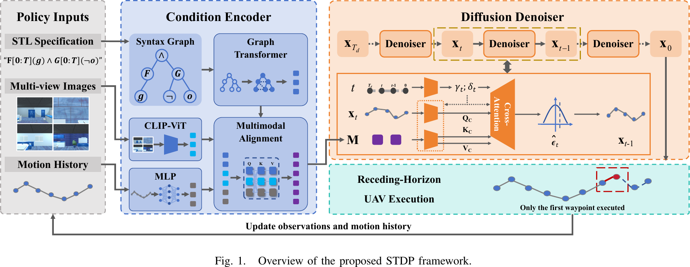
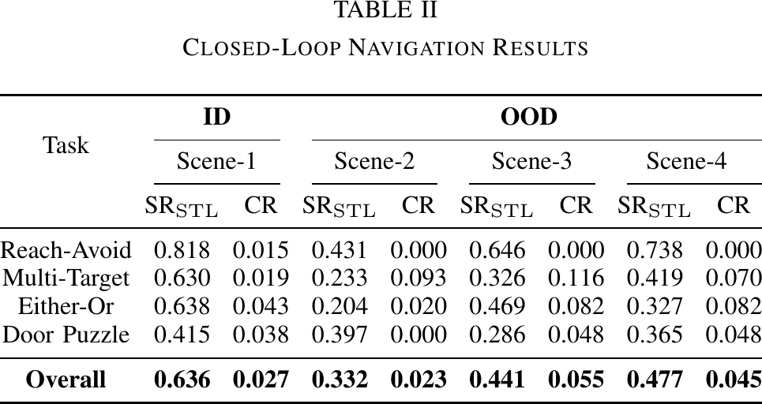
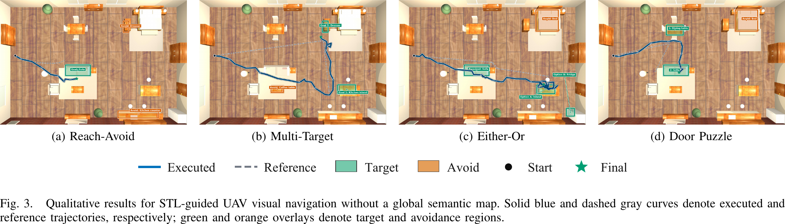
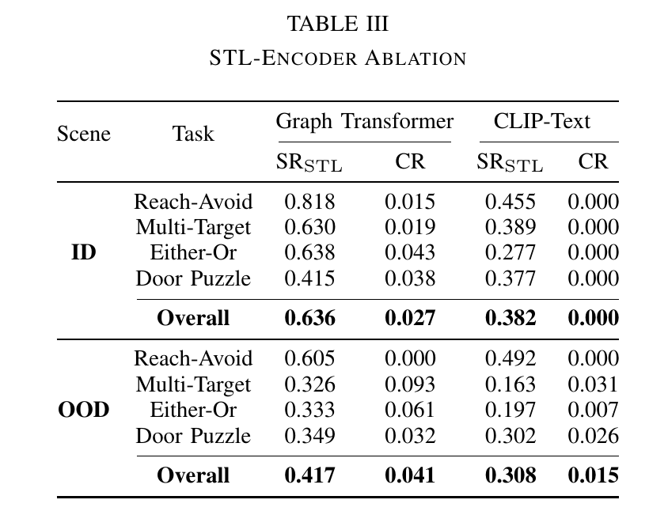
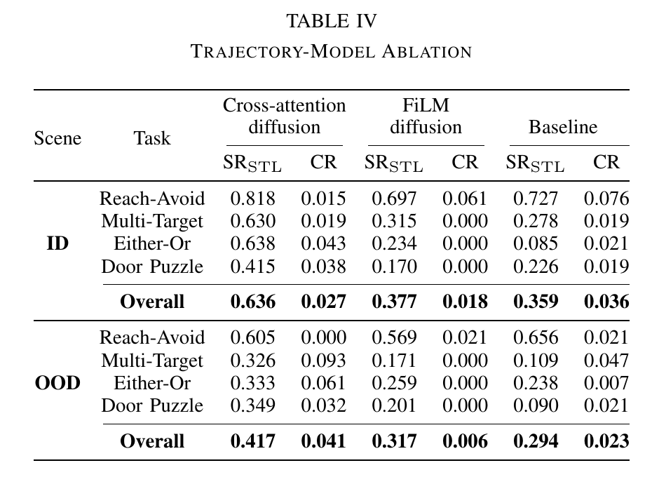
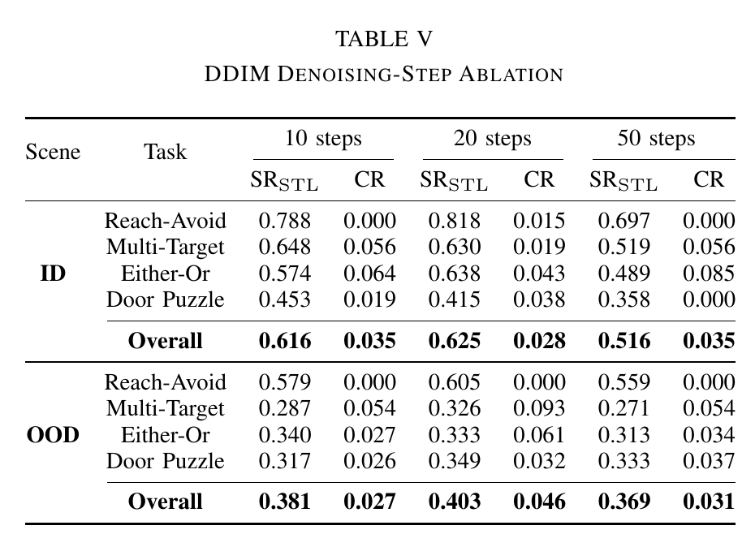

# STDP: Signal Temporal Logic-Guided Diffusion Policy for UAV Visual Navigation without Global Semantic Maps

> This repository is anonymized for double-blind review.

## Open-Source Progress

[](https://huggingface.co/datasets/bfz111/STDP-Dataset)


| Component | Status |
|---|---|
| Dataset | [Released on Hugging Face](https://huggingface.co/datasets/bfz111/STDP-Dataset) |
| Model weights | Released |
| Source code | Coming soon |

## Video

[Download the demonstration video](https://github.com/SANIS-HITSZ/STDP/raw/refs/heads/main/assets/STDP_demo.mp4) (MP4, 2 min 58 s, 1080p).

The video introduces STDP and includes complete real-world demonstrations of the Reach-Avoid, Multi-Target, Either-Or, and Door-Puzzle tasks.

## Method

We introduce the Signal Temporal Logic-Guided Diffusion Policy (STDP), which
generates receding-horizon three-dimensional (3-D) waypoints from STL
specifications, local multi-view RGB observations, and motion history. It
combines a relation-aware graph Transformer with cross-attention-based
conditional diffusion.

<p align="center">
  
</p>

### Closed-Loop Planning Algorithm

**Algorithm 1: UAV Visual Navigation without a Global Semantic Map**

```text
Require: STL specification phi, trained policy pi_theta, horizon H,
         diffusion steps T_d, and rollout length K_phi
1:  Parse phi once into typed graph G_phi
2:  Initialize waypoint history h_0 from the episode origin
3:  for k = 0, 1, ..., K_phi - 1 do
4:      Acquire front, down, left, and right RGB views o_k
5:      Encode G_phi, o_k, and h_k as memory M_k
6:      Sample x_Td ~ N(0, I)
7:      for each selected reverse diffusion time t do
8:          epsilon_hat <- Dec_theta(x_t, t, M_k)
9:          Update x_t-1 with the diffusion scheduler
10:     end for
11:     De-standardize and reshape x_0 into H waypoints
12:     Execute the first waypoint; append the reached pose to form h_k+1
13: end for
```

## Experimental Results

STDP achieves 63.6% ID STL success with a 2.7% collision rate and 41.7% OOD
success with a 4.1% collision rate under changed layouts and furniture
placement. Figure 3 shows successful plans for all four STL task families.

<p align="center">
  
</p>

<p align="center">
  
</p>

### Ablation Studies

#### 1. STL Encoder

The graph Transformer increases overall SR<sub>STL</sub> from 38.2% to 63.6% in
ID and from 30.8% to 41.7% in OOD, supporting more effective STL encoding than
CLIP-Text.

<p align="center">
  
</p>

#### 2. Trajectory Model

Cross-attention-based conditional diffusion outperformed FiLM-based
conditional diffusion across scenes and task families, with overall gains of
25.9 points in ID and 10.0 points in OOD.

<p align="center">
  
</p>

#### 3. DDIM Denoising Steps

Table V shows the performance of different DDIM denoising steps, where 20 steps
outperformed both 10 and 50 steps; we therefore used 20 steps throughout.

<p align="center">
  
</p>

## Released Dataset and Model Weights

### Dataset

The complete dataset is hosted on
[Hugging Face](https://huggingface.co/datasets/bfz111/STDP-Dataset). It contains
synchronized Gazebo observations and reference trajectories from four
furnished indoor scenes. Each trajectory includes:

- a semantic STL specification and its coordinate-grounded form;
- synchronized `front`, `down`, `left`, and `right` RGB observations; and
- a CSV trajectory containing absolute XYZ positions, camera yaw, frame
  indices, and image filenames.

The `splits/` directory provides the following manifests:

- `train.jsonl`: training data from the primary scene;
- `validation.jsonl`: validation data from the primary scene;
- `test_same.jsonl`: evaluation data from the primary scene; and
- `test_cross.jsonl`: cross-layout evaluation data from the remaining scenes.

Each JSONL record contains the STL formula, task type, scene identifier,
trajectory path, and four image-directory paths. The dataset is distributed as
one archive per trajectory. Extracting an archive restores its `data/` paths
relative to the dataset root. To use the dataset, select a split, read its
JSONL records, download and extract the corresponding trajectory archives,
then load the referenced CSV and synchronized image files.

### Model Weights

`model/STDP.pt` contains the Stage 1 weights used for evaluation. The checkpoint
includes:

- the project-specific model state;
- the model and inference configuration;
- trajectory normalization statistics; and
- checkpoint metadata.

The frozen CLIP vision and text parameters are intentionally excluded. The
required `openai/clip-vit-base-patch32` model must be downloaded separately or
provided through a local `transformers` cache. The checkpoint also excludes
optimizer state and local filesystem paths.

Loading the weights requires the forthcoming source code. The expected loading
sequence is:

1. Instantiate the STDP architecture from the stored configuration.
2. Initialize the frozen CLIP vision and text encoders from
   `openai/clip-vit-base-patch32`.
3. Load the project-specific state from `checkpoint["model"]`.
4. Use `checkpoint["trajectory_stats"]` to normalize motion history and
   denormalize predicted waypoints.

For inference, provide a semantic STL formula, four synchronized RGB views,
and the executed XYZ history. The model predicts a five-waypoint window in
normalized coordinates. Convert it to absolute XYZ coordinates with the stored
mean and standard deviation, execute the first waypoint, update the inputs, and
repeat.

## Citation

Coming soon.
